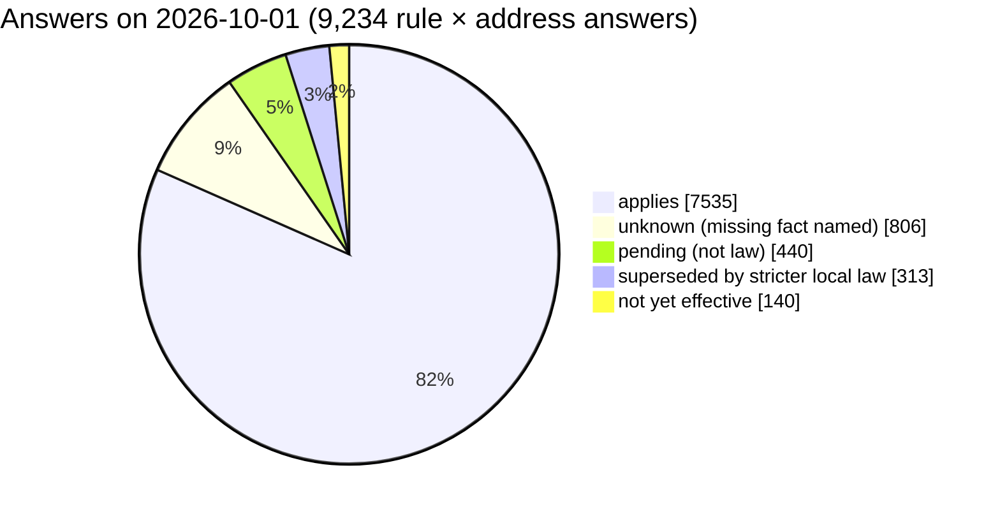
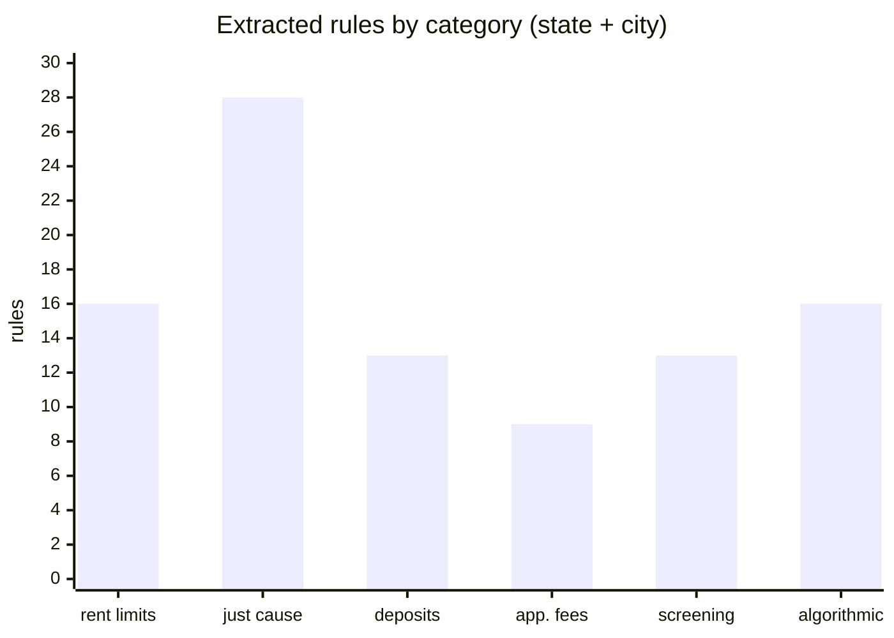
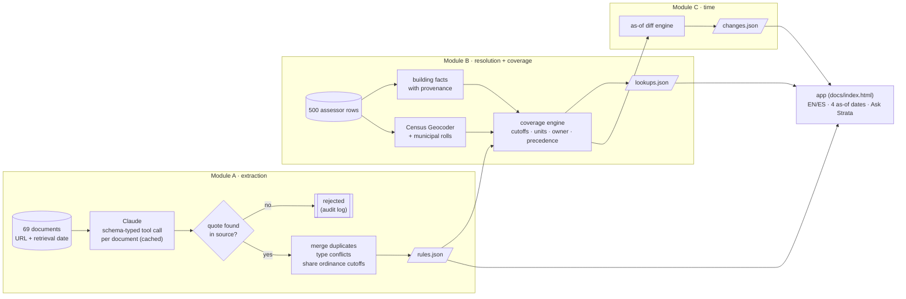
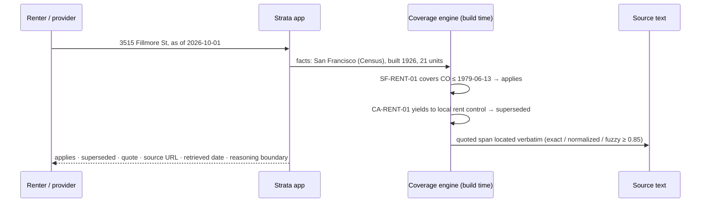

<p align="center"></p>

<h1 align="center">Strata · Rental Housing Law Navigator</h1>

<p align="center"><b>Housing law for one front door, layer by layer.</b><br>
For any of 500 real apartment buildings: <i>which housing rules apply here today, and what is about to change?</i><br>
Every answer quotes the sentence of law it rests on. <b>Not legal advice.</b></p>

<p align="center">
<a href="https://teeraphat2543inta.github.io/strata-rental-law-navigator/"><b>▶ Live demo</b></a> ·
<a href="METHOD_NOTE.md">Method note</a> ·
<a href="#architecture">Architecture</a> ·
<a href="#evaluation">Evaluation</a> ·
<a href="#related-work">Related work</a><br><br>


</p>

Hack-Nation 7th Global AI Hackathon · Challenge 02 (RealPage) · team **Thai_win**

---

## Contents

1. [The problem](#the-problem) · 2. [What Strata does](#what-strata-does) · 3. [Results](#evaluation) ·
4. [Architecture](#architecture) · 5. [The hard cases](#the-hard-cases) · 6. [The app](#the-app) ·
7. [Run it](#run-it) · 8. [Repository layout](#repository-layout) · 9. [Data](#data) ·
10. [Responsible design](#responsible-design) · 11. [Scaling](#adding-a-jurisdiction) ·
12. [Limitations](#limitations) · 13. [Related work](#related-work)

## The problem

A renter in San Francisco lives under a state statute (Cal. Civ. Code § 1947.12), a city ordinance
(S.F. Admin. Code ch. 37) and a calendar: bills that are pending, statutes that take effect next January, ballot
questions that were struck. Which layer governs depends on facts about the *building* (certificate-of-occupancy
date, unit count, owner type) and on the *date* you ask. The text is public, but it is scattered across 87 documents,
and the answer for one front door is nowhere written down.

Large language models are fluent at summarizing law and unreliable at being right about it: general-purpose models
hallucinate on a large share of verifiable legal queries ([Dahl et al., 2024](#ref-dahl)), and even purpose-built
legal research tools still produce unsupported answers ([Magesh et al., 2024](#ref-magesh)). Strata is built
around that finding: **the model proposes, deterministic code disposes.**

## What Strata does

| Step | Who does it | Guarantee |
|---|---|---|
| Read 69 documents and propose rules with machine-readable coverage | Claude (one schema-typed tool call per document, cached) | none yet: a proposal |
| Find every quoted span in its source | code (`nav/quotes.py`) | a published rule's quote exists verbatim in the cited source |
| Merge duplicates, type conflicts, share ordinance cutoffs | code + one LLM grouping call | disagreeing effective dates are flagged, never silently resolved |
| Resolve the legal city of each building | U.S. Census Geocoder + municipal rolls | the method and confidence travel with every answer |
| Decide applies / superseded / unknown / not yet effective / pending | code (`nav/engine.py`) | `unknown` whenever a needed fact is missing, with the fact named |
| Track change tests across dates | code (`nav/changes.py`) | T1–T5 reproduce from one command |

<a id="evaluation"></a>
## Results

All numbers below are produced by `python run.py check` and `python run.py score` on this commit
(`out/selfcheck.txt`, `out/score_self.txt`). The organizers' scoring script and held-out key are not
distributed to participants, so these are transparent self-measurements, not official scores.

| Measure | Result |
|---|---|
| Rules extracted (automated, from 69 documents) | **95** |
| Quotes found verbatim in the cited source | **95 / 95** (100%) |
| `applies` answers backed by a verified quote | **7,535 / 7,535** (100%) |
| Addresses answered · legal jurisdiction resolved | **500 / 500 · 500 / 500** |
| Rule records valid against the starter-pack JSON Schema | **95 / 95** |
| Change tests T1–T5 (affected sets, T3 conflict flags) | **5 / 5 pass** |
| Conflict flags raised | **4**, each a real conflict (preemption or disputed effective date) |
| Rules rejected because their quote was not in the source | 1 (kept in the audit log) |
| Unit tests (no network, no key) | **19 / 19** |
| Cost of extracting the whole corpus | ≈ US$3, cached; reruns are free |





| Change test | Expected | Strata | Pass |
|---|---|---|:---:|
| T1 · CA AB 325 / SB 763 | not yet effective 2025-12-31 → applies 2026-01-02, every CA address | 250 of 250 CA addresses | ✅ |
| T2 · Hoboken and Jersey City bans | each ban only inside its own city; none in Newark | 90 affected, Newark leakage 0 | ✅ |
| T3 · NJ FAIR Act | not yet effective 2026-10-01 → applies 2027-07-02; flags in JC + Hoboken | 140 affected, 90 flagged | ✅ |
| T4 · MA S.2983 / H.5222 | pending, never in force; all MA addresses | 110 affected, 0 reported in force | ✅ |
| T5 · MA ballot question | struck → no rent cap in Boston or Cambridge; empty set | 0 affected, 0 rent caps reported | ✅ |

<a id="architecture"></a>
## Architecture



How one answer is produced:



| Module | File | Responsibility |
|---|---|---|
| A | `nav/extract.py` | prompt and tool schema, chunking above 110k chars, quote verification, LLM-assisted clustering, conflict typing, ordinance-coverage inheritance, stable IDs (`SF-RENT-01`) |
| A | `nav/quotes.py` | quote locator: exact → whitespace/typography-normalized with an index map back to the source → bounded fuzzy |
| A | `nav/llm.py` | stdlib Messages API client, retries with back-off, on-disk cache keyed by (model, prompt, tool) |
| B | `nav/geocode.py`, `nav/properties.py` | Census Geocoder (cached), legal-city resolution with method and confidence, building facts with provenance |
| B | `nav/engine.py` | coverage per rule × building × date, precedence, conflict flags, "checked but not reaching" explanations |
| C | `nav/changes.py` | T1–T5 and a T*n* for every document added later |
| — | `nav/build.py`, `app/index.template.html` | submission files and the single-file app |
| — | `nav/selfcheck.py`, `nav/score.py` | pass/fail report and per-component self-score |

## The hard cases

| Trap in the data or the law | What Strata does |
|---|---|
| **Postal city ≠ legal city.** 39 of 500 rows carry a neighborhood or another city ("Dorchester", "Allston"). | The Census Geocoder decides the incorporated place; method and confidence are shown on every answer. |
| **Same street, two cities.** "322 Western Ave" exists in Cambridge and in Allston (Boston); the geocoder picks Boston. | A municipal assessor roll only lists parcels inside its city, so the roll outranks the geocoder when they disagree, and the app says why. |
| **NJ ZIPs are the owner's mailing ZIP** (Brooklyn, Austin…). | NJ is never geocoded by ZIP; the taxing municipality is used and 27 rows are flagged. |
| **Missing unit counts** (Jersey City, Newark, Hoboken, Berkeley, Boston). | Read from what the record encodes: MOD-IV `4S-B-A-16U-H` = 16 units, NJ class 4C = 5+, Boston class A = 7+, assessor use classes; the method is shown next to the number. |
| **Year built ≠ certificate of occupancy** (SF ≤ 1979-06-13, LA ≤ 1978-10-01). | A cutoff-year building is `unknown`, and a state cap that would yield to it becomes `unknown` too. |
| **One ordinance, many pages.** "This year's increase is 3%" without the coverage clause. | Rules of the same city, category and code chapter inherit the ordinance's building cutoff, with a caveat naming the donor rule. |
| **A ban on rent control is not a rent cap** (M.G.L. c. 40P). | Recorded as a cited *no-rule finding*; Boston and Cambridge show a confirmed absence. |
| **Proposals look like laws** (drafts, first readings, motions, policy orders, study orders). | `pending` or `failed`, never `in_force` (7 pending, 3 failed). |
| **Statutes without a printed effective date** (AB 325, chaptered 2025-10-06). | California's constitutional default (art. IV § 8(c): 1 January of the next year) is applied only when the chaptered line is in the document, and quoted. |
| **The model can invent.** | No verbatim quote, no rule. |
| **"Conflict" can mean anything.** | Typed as `effective_date`, `preemption` or `litigation`; everything else is a caveat. Flags fell from 60 to 4 when this was introduced. |

## The app

Single static file (`docs/index.html`, served by GitHub Pages), no server, no tracking.

| Page | What it shows |
|---|---|
| Welcome tour | four animated steps: layers, verified quotes, time, honest `unknown` |
| Overview | KPIs, answer-mix donut, rules by category, five hard cases one click away |
| Address lookup | searchable, paginated list; jurisdiction stack (state → city → confirmed absences); plain-language rights card; computed insight; date-to-date diff; rules checked but not reaching the building, with the reason |
| What's changing | T1–T5 with affected cities and conflict flags |
| Portfolio & timeline | coverage by city × category for a housing provider's portfolio; every effective date and pending measure with the number of buildings it reaches |
| Rule library | filters, search, pagination, a drawer with the full record and machine-readable coverage |
| Sources & audit | the self-check of the build, every source document with retrieval date, and the sources that could not be read |
| **Ask Strata** (⌘K) | **Grounded mode**: answers computed from the extracted rules, every claim linked to its rule and quote, so it cannot invent law. **Claude mode** (optional): Claude writes the answer from retrieved rules only, using the viewer's own key, kept in the browser tab; cited IDs are checked against the rule set. |

Everything is available in English and Spanish, in light and dark themes, at phone width, and says
"Not legal advice" on every screen.

## Run it

```bash
make setup                                   # links the starter pack (STARTER_PACK=/path/to/pack)
export ANTHROPIC_API_KEY=...                 # extraction only; everything else is offline
make all                                     # geocode → extract → build → check → score
make test                                    # 19 unit tests, no key, no network
```

or step by step:

```bash
python run.py geocode        # Census Geocoder → cache/geocode
python run.py fetch-links    # read link-only sources, one request per page (organizer-approved)
python run.py extract        # Module A over the corpus (≈ US$3, ≈ 15 min; cached → reruns are free)
python run.py build          # Modules B + C → out/*.json, out/index.html, docs/index.html
python run.py check          # PASS/FAIL report + coverage grid
python run.py score          # self-score per auto-scored component
python run.py add-doc new.txt --jurisdiction "City, ST" --url URL   # a new law, extracted unaided → next change test
```

Python 3.9+, standard library only. `ANTHROPIC_MODEL` defaults to `claude-sonnet-5-5`.

## Repository layout

```
run.py                  single entry point (geocode · fetch-links · extract · build · check · score · add-doc)
nav/                    the pipeline (one module per stage, see Architecture)
app/index.template.html the app; build.py injects the data bundle
tests/                  test_units.py (19 unit tests) · test_pipeline.py (end-to-end with recorded model outputs)
cache/llm/              raw model output per document: the audit trail of what the model said
cache/geocode/          Census Geocoder responses
out/                    submission files: rules.json · lookups.json · changes.json (+ detail, findings, properties, audit log, self-check)
docs/                   GitHub Pages: index.html (the app) and brand assets
METHOD_NOTE.md          one-page method note
```

## Data

* **Corpus:** 54 starter-pack documents with text, plus 15 link-only sources fetched individually (69 in all).
  The organizers confirmed on 2026-10-04 that individual pages in `links_only.csv` may be fetched, one request per
  page with the retrieval date recorded and no bulk scraping; `fetch-links` does exactly that, 1.5 s apart. Pages
  that refused (403) or held no law text are listed in the app as unread and never cited. Fetched third-party text
  is not committed; its URL and retrieval time are (`extra_docs/extra_manifest.csv`).
* **Addresses:** the 500 sample properties (public assessor data, no owner names), resolved with the free U.S.
  Census Geocoder.
* No customer, resident, pricing or other non-public data is used. The starter pack is not redistributed.

## Responsible design

* Source sentence, URL, retrieval date and as-of date on every answer.
* Enacted, not-yet-effective, pending and failed kept apart; failed measures never produce a rule.
* `unknown` whenever a needed fact is missing, with the missing fact named.
* Conflict flags only for real conflicts; caveats shown separately; a confidence value per rule.
* A written reasoning boundary on every answer: what was checked and what was not.
* An audit log of every extraction, quote check, merge and rejection, plus the raw model output per document.
* The assistant answers only from extracted law; the app explains rules and never suggests ways around them.
* "Not legal advice" on every screen.

## Adding a jurisdiction

1. Put the ordinance or statute text in `extra_docs/` (or `python run.py add-doc`).
2. Add the city to `JURISDICTIONS` (`nav/extract.py`) and `CITIES` (`nav/properties.py`); if its assessor data is
   a municipal roll, add it to `MUNICIPAL_ROLLS`.
3. `python run.py extract && python run.py build`. Prompt, verifier, engine, change tracker, app and assistant are
   jurisdiction-agnostic; nothing about a city is hard-coded.

## Limitations

The model can misread a coverage condition; the verbatim quote on every rule and the self-check make such errors
visible, not impossible. Exact certificate-of-occupancy dates and owner identity are not in the data, so answers
that depend on them stay `unknown`. The app precomputes four as-of dates; any other date is one `build` away.
Link-only sources that could not be fetched are listed and not used.

<a id="related-work"></a>
## Related work

How published research shaped specific design choices:

| # | Work | What we took from it |
|---|---|---|
| <a id="ref-dahl"></a>1 | M. Dahl, V. Magesh, M. Suzgun, D. E. Ho. *Large Legal Fictions: Profiling Legal Hallucinations in Large Language Models.* Journal of Legal Analysis 16(1), 2024. [arXiv:2401.01301](https://arxiv.org/abs/2401.01301) | General LLMs hallucinate frequently on legal questions → the model never has the last word; every published rule must be tied to a verbatim source sentence. |
| <a id="ref-magesh"></a>2 | V. Magesh, F. Surani, M. Dahl, M. Suzgun, C. D. Manning, D. E. Ho. *Hallucination-Free? Assessing the Reliability of Leading AI Legal Research Tools.* 2024. [arXiv:2405.20362](https://arxiv.org/abs/2405.20362) | Retrieval alone does not eliminate unsupported claims → verification is done by code after generation, and the assistant's grounded mode computes answers instead of generating them. |
| 3 | P. Lewis et al. *Retrieval-Augmented Generation for Knowledge-Intensive NLP Tasks.* NeurIPS 2020. [arXiv:2005.11401](https://arxiv.org/abs/2005.11401) | Claude mode of Ask Strata retrieves the relevant extracted rules and generates only from them. |
| 4 | T. Gao, H. Yen, J. Yu, D. Chen. *Enabling Large Language Models to Generate Text with Citations.* EMNLP 2023. [arXiv:2305.14627](https://arxiv.org/abs/2305.14627) | Citation quality must be checked, not assumed → cited rule IDs in generated answers are validated against the rule set; every `applies` answer is measured for a verified quote. |
| 5 | N. Guha et al. *LegalBench: A Collaboratively Built Benchmark for Measuring Legal Reasoning in Large Language Models.* NeurIPS 2023 Datasets & Benchmarks. [arXiv:2308.11462](https://arxiv.org/abs/2308.11462) | Rule-application tasks are where models are weakest → coverage tests (cutoffs, unit counts, precedence) run in deterministic code over model-extracted *conditions*. |
| 6 | S. Kadavath et al. *Language Models (Mostly) Know What They Know.* 2022. [arXiv:2207.05221](https://arxiv.org/abs/2207.05221) | Calibrated abstention is valuable → `unknown` is a first-class answer and model confidence is shown per rule, never used to fill a missing fact. |
| 7 | R. Diamond, T. McQuade, F. Qian. *The Effects of Rent Control Expansion on Tenants, Landlords, and Inequality: Evidence from San Francisco.* American Economic Review 109(9), 2019. | Coverage hinges on building vintage (SF's 1979 cutoff) → certificate-of-occupancy cutoffs are machine-readable coverage, and the cutoff year is `unknown`. |
| 8 | M. Desmond. *Evicted: Poverty and Profit in the American City.* Crown, 2016. | Renters rarely know which protections apply → a plain-language rights card per address, in English and Spanish. |
| 9 | U.S. Census Bureau. *Census Geocoder* documentation. | Legal place, not postal city, decides jurisdiction. |
| 10 | California Constitution, art. IV, § 8(c). | Default effective date for regular-session statutes (1 January of the following year). |

## License

Code: MIT (see `LICENSE`). Law text belongs to its public sources (URLs and retrieval dates in `out/rules.json`).
