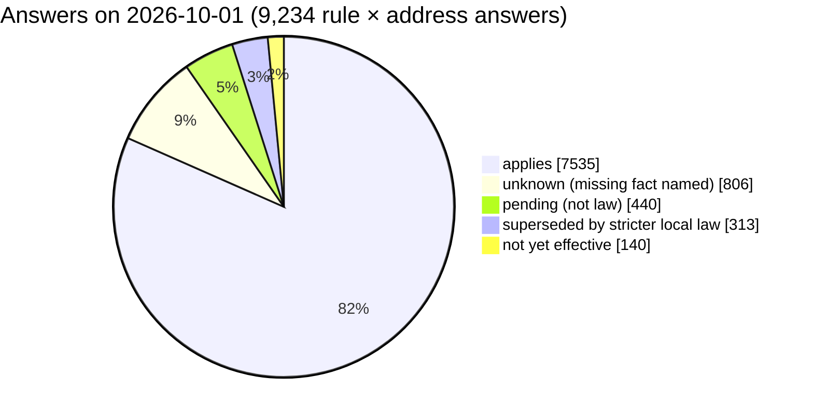
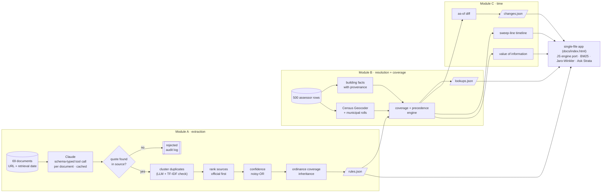
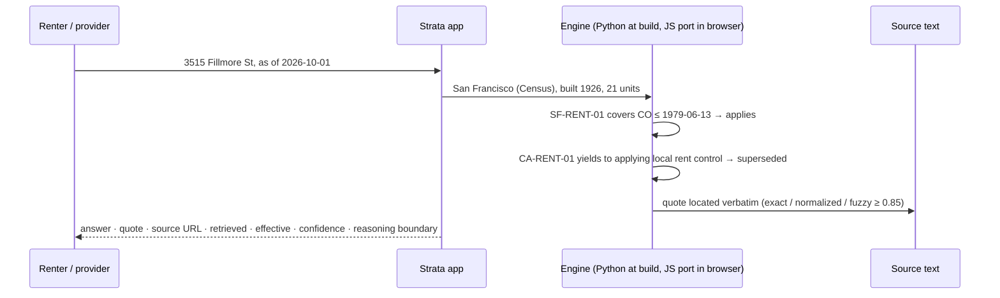

<p align="center"></p>

<h1 align="center">Strata · Rental Housing Law Navigator</h1>

<p align="center"><b>Housing law for one front door, layer by layer.</b><br>
For any of 500 real apartment buildings: <i>which housing rules apply here today, and what is about to change?</i><br>
Every answer quotes the sentence of law it rests on. <b>Not legal advice.</b></p>

<p align="center">
<a href="https://teeraphat2543inta.github.io/strata-rental-law-navigator/"><b>▶ Live app</b></a> ·
<a href="METHOD_NOTE.md">Method note</a> ·
<a href="REQUIREMENTS.md">Requirements traceability</a> ·
<a href="#5-algorithms">Algorithms</a> ·
<a href="#9-testing-and-quality">Testing</a><br><br>


</p>

Hack-Nation 7th Global AI Hackathon · Challenge 02 (RealPage) · team **Thai_win**

---

## Contents

1. [The problem](#1-the-problem) · 2. [What Strata guarantees](#2-what-strata-guarantees) · 3. [Results](#3-results) ·
4. [Architecture](#4-architecture) · 5. [Algorithms](#5-algorithms) · 6. [The hard cases](#6-the-hard-cases) ·
7. [The app](#7-the-app) · 8. [Ask Strata, the assistant](#8-ask-strata-the-assistant) · 9. [Testing and quality](#9-testing-and-quality) ·
10. [Run it](#10-run-it) · 11. [Repository layout and data contracts](#11-repository-layout-and-data-contracts) · 12. [Data](#12-data) ·
13. [Responsible design and security](#13-responsible-design-and-security) · 14. [Scaling](#14-adding-a-jurisdiction) ·
15. [Limitations](#15-limitations) · 16. [Related work](#16-related-work)

## 1. The problem

A renter in San Francisco lives under a state statute (Cal. Civ. Code § 1947.12), a city ordinance
(S.F. Admin. Code ch. 37) and a calendar: bills that are pending, statutes that take effect next January, ballot
questions that were struck. Which layer governs depends on facts about the *building* (certificate-of-occupancy
date, unit count, owner type) and on the *date* you ask. The text is public but scattered across 87 documents, and
the answer for one front door is written down nowhere.

Language models summarize law fluently and are unreliable at being right about it: general-purpose models
hallucinate on a large share of verifiable legal queries ([Dahl et al., 2024](#ref-dahl)), and even purpose-built
legal research tools still produce unsupported answers ([Magesh et al., 2024](#ref-magesh)). Strata is designed
around that finding: **the model proposes, deterministic code disposes.**

## 2. What Strata guarantees

| Stage | Who does it | Guarantee |
|---|---|---|
| Read 69 documents, propose rules with machine-readable coverage | Claude, one schema-typed tool call per document, cached | a proposal, nothing more |
| Ground every rule in its source | code (`nav/quotes.py`) | a published rule's quote exists verbatim in the cited source; otherwise the rule is rejected |
| Merge duplicates, type conflicts, rank sources | code + one cached LLM grouping call | official text outranks restatements; disagreeing dates are flagged, never silently resolved |
| Resolve the legal city of each building | Census Geocoder + municipal rolls | method and confidence travel with every answer |
| Decide applies / superseded / unknown / not yet effective / pending | code (`nav/engine.py`) | `unknown` whenever a needed fact is missing, naming the fact |
| Track change tests across dates | code (`nav/changes.py`, `nav/temporal.py`) | T1–T5 reproduce from one command; any date can be queried |

## 3. Results

Produced by `python run.py check` and `python run.py score` on this commit. The organizers confirmed that their
scoring script and held-out key are not shared with participants, so these are transparent self-measurements.

| Measure | Result |
|---|---|
| Rules extracted (automated, from 69 documents) | **95** (84 in force · 1 not yet effective · 7 pending · 3 failed) |
| Quotes found verbatim in the cited source | **95 / 95** |
| `applies` answers backed by a verified quote | **7,535 / 7,535** |
| Addresses answered · legal jurisdiction resolved | **500 / 500 · 500 / 500** |
| Rule records valid against the starter-pack JSON Schema | **95 / 95** |
| Change tests T1–T5 (affected sets, T3 conflict flags) | **5 / 5 pass** |
| Rules whose primary source is official text | **80 / 95** (15 known only from secondary pages, capped at 0.6 confidence) |
| Typed conflict flags | **4** (preemption or disputed effective date) |
| Human-review queue | **19** rules (4 conflicts + 15 secondary-source-only) |
| Proposals rejected for an unlocatable quote | 1 (kept in the audit log) |
| Unit tests · end-to-end tests | **26 / 26** · pipeline + engine parity pass |
| In-browser engine vs Python engine | **2,000 / 2,000** identical answers (explanations included) |
| Sweep-line timeline vs direct evaluation | **0 mismatches** at 2,000 address × date points |
| Duplicate grouping, TF-IDF vs LLM | pairwise F1 0.62 (precision 0.76, recall 0.81) over 36 groups |
| Cost of extracting the corpus | ≈ US$3, cached; rebuilds are free |



| Change test | Expected | Strata | Pass |
|---|---|---|:---:|
| T1 · CA AB 325 / SB 763 | not yet effective 2025-12-31 → applies 2026-01-02, every CA address | 250 of 250 | ✅ |
| T2 · Hoboken and Jersey City bans | each only inside its own city; none in Newark | 90 affected, Newark 0 | ✅ |
| T3 · NJ FAIR Act | not yet effective 2026-10-01 → applies 2027-07-02; flags in JC + Hoboken | 140 affected, 90 flagged | ✅ |
| T4 · MA S.2983 / H.5222 | pending, never in force; all MA addresses | 110 affected, 0 in force | ✅ |
| T5 · MA ballot question | struck → no rent cap in Boston or Cambridge; empty set | 0 affected, 0 caps | ✅ |

## 4. Architecture





| Module | File | Responsibility |
|---|---|---|
| A | `nav/extract.py` | prompt and tool schema, chunking above 110k chars, quote grounding, clustering, source ranking, conflict typing, confidence, coverage inheritance, review queue, stable IDs (`SF-RENT-01`) |
| A | `nav/quotes.py` · `nav/dedupe.py` · `nav/confidence.py` | quote locator · TF-IDF clustering · noisy-OR confidence |
| A | `nav/llm.py` · `nav/fetch.py` · `nav/corpus.py` | stdlib Messages API client with on-disk cache · polite link fetcher · corpus loader |
| B | `nav/geocode.py` · `nav/properties.py` | Census Geocoder (cached) · legal-city arbitration and building facts with provenance |
| B | `nav/engine.py` | coverage per rule × building × date, precedence, conflict flags, "checked, does not reach" reasons |
| C | `nav/changes.py` · `nav/temporal.py` · `nav/voi.py` | change tests · sweep-line timelines · value-of-information ranking |
| — | `nav/build.py` · `app/index.template.html` | submission files and the single-file app |
| — | `nav/selfcheck.py` · `nav/score.py` | pass/fail report · per-component self-score |

## 5. Algorithms

Thirteen algorithms, each chosen for a specific failure mode of this task. New ones are marked ★.

### 5.1 Three-tier quote grounding · `nav/quotes.py`
*Principle:* a rule exists only if its sentence exists. *Flow:* (1) exact substring search; (2) normalize both texts
(whitespace, typographic quotes and dashes, NBSP) while keeping an index map from every normalized character back to
its source offset, search again, and return the **source's own characters**; (3) bounded fuzzy search over windows of
1–6 consecutive sentences no longer than 1.6 × the quote, `difflib.SequenceMatcher` ratio ≥ 0.85, with the cheap
`real_quick_ratio`/`quick_ratio` bounds pruning most windows. *Outcome:* rejected if nothing matches. *Cost:* O(n) for
tiers 1–2; tier 3 is O(s·w) windows with early pruning. *Result:* 106 exact, 22 normalized, 1 rejected.

### 5.2 ★ TF-IDF + union-find duplicate detection · `nav/dedupe.py`
*Principle:* an independent, deterministic check on the LLM's grouping. *Flow:* tokens of title + requirement +
citation → TF-IDF with sublinear tf `1 + ln(tf)` and smoothed idf `ln((1+n)/(1+df) + 1)` → L2-normalized vectors →
link two records if cosine ≥ 0.55 or their normalized citation keys match → connected components with path-compressed
union-find. *Evaluation:* pairwise precision / recall / F1 of the deterministic clusters against the LLM's, per
(jurisdiction, category); reported in the self-check (F1 0.62, P 0.76, R 0.81).

### 5.3 Source ranking and the secondary-source policy · `nav/extract.py`
*Principle:* official text outranks restatements. Records of one provision are sorted by
(quote quality, source rank: official < city-linked policy < code publisher < secondary, model confidence); the
first becomes `source_doc_id`, the rest `supporting_docs`. A provision known **only** from law-firm or news pages keeps
`confidence ≤ 0.6`, gets the note *"Secondary source only — official text not captured; verify against the ordinance."*
and joins the review queue (15 rules).

### 5.4 Typed conflict detection · `nav/extract.py`
The extractor must classify any conflict as `effective_date`, `preemption` or `litigation`; anything else (secondary
source, approximate citation, yearly-adjusted figure) is a **caveat**. Code adds a conflict when merged sources give
different effective dates, and keeps a corroborating source's date as a caveat when the lead source has none. Flags fell
from 60 to 4 when typing was introduced.

### 5.5 ★ Evidence-weighted confidence (noisy-OR) · `nav/confidence.py`
*Principle:* independent corroboration should raise confidence, weak evidence should lower it.
`evidence = 1 − Π(1 − wᵢ)` over supporting sources, with `wᵢ = source weight (official 0.9, city-linked 0.8, other 0.7,
fetched secondary 0.6) × quote factor (exact 1, normalized 0.95, fuzzy = its ratio)`; × 0.9 if a caveat exists,
× 0.8 if a typed conflict exists. `confidence = 0.5 · model + 0.5 · evidence`. Rules below 0.6 join the review queue.

### 5.6 Ordinance coverage inheritance · `nav/extract.py`
A city page saying "this year's increase is 3%" rarely repeats which buildings the ordinance covers. Rules of the same
city and category whose citations resolve to the same **code chapter** (`ch. 37` ≡ `§ 37.3`; `ch. 13.76` ≡
`§ 13.76.110`) inherit the chapter's building cutoff from an enacted donor, with a caveat naming it. Without this, a
3% cap would silently reach a 2012 building.

### 5.7 Jurisdiction arbitration · `nav/properties.py`
Order of evidence: a municipal assessor roll (every row is inside that city) → the Census incorporated place →
postal city / known neighborhood aliases. When the roll and the geocoder disagree (322 Western Ave exists in Cambridge
*and* Allston), the roll wins and the app says why. NJ rows are never geocoded by ZIP (it is the owner's mailing ZIP).

### 5.8 Structured unit inference · `nav/properties.py`
Parses what the public record encodes: NJ MOD-IV building codes (`4S-B-A-16U-H` → 16; multi-building `/` codes are
summed or maxed), NJ class 4C (5+), Boston class A (7+), assessor ranges ("5 TO 14 UNITS", ">4-UNIT", "15 UNITS OR
MORE"). Every number carries its method; nothing is imputed.

### 5.9 Coverage and precedence engine · `nav/engine.py`
For each rule reaching the address's state or city: status on the date (`pending`/`failed` never apply; an enacted
rule with no stated date is never assumed in force) → coverage tests in order (certificate-of-occupancy cutoffs, rolling
N-year new-construction exemption, min/max units, small-building and owner-dependent exemptions), each returning
covered / not covered / **unknown with the missing fact named** (a cutoff-year building is unknown) → precedence:
a state rule that yields to local law becomes `superseded` where a local rule applies, and `unknown` where the local
coverage is itself unknown → conflict flags where a state rule may preempt a local rule of the same category, and on
every answer from a rule that carries a typed conflict.

### 5.10 ★ Sweep-line temporal engine · `nav/temporal.py`
*Principle:* answers are piecewise constant in time. They can only change at an effective date or at the calendar-year
boundaries of a rolling exemption (built Y, exempt N years → Jan 1 of Y+N and Y+N+1). Sweeping those candidate points
and evaluating once per segment yields each building's exact timeline; cost O(k · rules) per building instead of one
evaluation per day. The self-check proves equivalence with direct evaluation at 2,000 address × date points.

### 5.11 ★ Value-of-information ranking · `nav/voi.py`
Every `unknown` names the fact it depends on (certificate date, year built, unit count, owner identity, local coverage).
Grouping unknown answers by (fact, city) and ranking by answers and buildings turns uncertainty into a data plan:
collecting year built for Berkeley settles 160 answers in 40 buildings; for San Diego, 150 in 50.

### 5.12 ★ Okapi BM25 and Jaro-Winkler · app
Ask Strata ranks rules with BM25 (k₁ = 1.4, b = 0.75; title and state names boosted). Addresses typed with typos are
matched token-wise with Jaro-Winkler (threshold 0.86): "3515 filmore st" → 3515 Fillmore St.

### 5.13 ★ In-browser engine port · app
A JavaScript port of 5.9 evaluates any as-of date and powers the what-if simulator and the assistant's date questions.
`tests/e2e_engine_parity.py` compares it with the Python engine for every address at every precomputed date:
2,000 / 2,000 identical, explanations included.

## 6. The hard cases

| Trap | What Strata does |
|---|---|
| Postal city ≠ legal city (39 rows: "Dorchester", "Allston"…) | Census place decides; method and confidence shown |
| Same street, two cities | municipal roll outranks the geocoder (5.7) |
| NJ ZIP is the owner's mailing ZIP | taxing municipality; 27 rows flagged |
| Unit counts missing | parsed from the record's own encodings (5.8) |
| Year built ≠ certificate of occupancy (SF ≤ 1979-06-13, LA ≤ 1978-10-01) | cutoff-year buildings are `unknown`; dependent state caps become `unknown` too |
| One ordinance, many pages | chapter-level coverage inheritance (5.6) |
| A ban on rent control is not a rent cap (M.G.L. c. 40P) | cited *no-rule finding*; Boston and Cambridge show a confirmed absence |
| Proposals look like laws | drafts, first readings, motions, policy orders → `pending`; struck or study-ordered → `failed` |
| Statutes without a printed effective date (AB 325) | California's constitutional default (art. IV § 8(c)) only when the chaptered line is quoted |
| Law-firm and news pages restate law | official text is primary; secondary-only rules capped and queued (5.3) |
| The model can invent | no verbatim quote, no rule (5.1) |
| "Conflict" can mean anything | typed conflicts vs caveats (5.4) |

## 7. The app

One static file (`docs/index.html`, GitHub Pages), no server, no tracking, dark by default, English / Spanish, light /
dark, desktop / phone. "Not legal advice" on every screen.

| Page | What it shows |
|---|---|
| Intro (every visit, skippable) | six autoplaying slides; the last plots the real geocoded portfolio, totals and the next effective change; then Overview |
| Overview | KPIs, answer-mix donut, rules by category, five hard cases one click away |
| Address lookup | typo-tolerant search with pagination; jurisdiction stack (state → city → confirmed absences); plain-language rights card; computed insight; date-to-date diff; exact timeline of changes; what-if simulator; rules checked but not reaching the building, with the reason |
| What's changing | T1–T5 with affected cities, conflict flags and pass marks |
| Map | 485 geocoded buildings on a basemap; animated markers, pulse rings on buildings the next change reaches, per-city fly-to |
| Compare | up to three buildings side by side; differing rows highlighted |
| Portfolio & timeline | law roadmap (time axis, size = buildings reached), next-up countdowns, percent heatmap, value-of-information ranking |
| Rule library | facets with live counts, search, sort, cards or table, pagination; rule drawer with confidence ring, copyable quote, coverage chips, reach by city, corroborating sources |
| Sources & audit | evidence chain (documents → proposals → verified quotes → rules → answers → cited applies), self-check, human-review queue, unread sources, document cards |
| How it works | pipeline, 13 algorithms, coverage grid, responsible design |

The as-of selector offers four precomputed dates plus a date picker for any date (computed by the in-browser engine).
Deep links (`#/lookup?addr=A0016&asof=2027-07-02&lang=es`) reproduce any view.

## 8. Ask Strata, the assistant

| Capability | How |
|---|---|
| **Grounded answers** (default) | intent parsing (address, city, state, category, exact date, rule ID, test ID) → retrieval (BM25, Jaro-Winkler) → answers **computed** from the engine and the extracted rules, rendered as tables and bars; every claim links to its rule and quote. It cannot invent law. |
| **Agent actions** | plans and executes visible steps: open a building, compare buildings, time-travel to a date, translate, switch theme, filter the rule library, open the map, export a building or a rule list to CSV, start the tour |
| **Claude mode** (optional) | Claude writes the answer from the retrieved rules only, citing rule IDs that are checked against the rule set; uses the viewer's own API key, kept in the browser tab and sent only to api.anthropic.com |
| Guidance | page-aware suggestions, thinking steps, staggered answer reveal, page nudges; ⌘K anywhere |

## 9. Testing and quality

| Layer | Command | What it proves |
|---|---|---|
| Unit | `make test` (26 tests, stdlib, no key, no network) | quote grounding, coverage edge cases, precedence, statewide reach outside covered cities, city boundaries, time logic, unit parsing, ordinance keys, sweep-line, noisy-OR, TF-IDF clustering, value of information |
| End-to-end | `python tests/e2e_pipeline.py` | the whole pipeline with recorded model outputs; T1–T5 plumbing |
| Self-check | `python run.py check` | schema, verbatim quotes, citation coverage, jurisdiction, T1–T5, published app carries this build, sweep-line ≡ direct evaluation, dedupe agreement |
| Engine parity | `python tests/e2e_engine_parity.py` | JS engine ≡ Python engine on 2,000 address × date answers |
| UI | Playwright over every route in light/dark at 1440 px and 390 px | no page errors, no horizontal overflow, injected markup inert, data present on every page, agent actions and CSV export work |

A senior-review pass found and fixed: statewide rules not reaching addresses outside the covered cities; an enacted rule
without a date being treated as in force; a corroborating date dropped during merge; the assistant snapping dates to
precomputed ones; coarse ordinance keys; unvalidated link URLs and CSV formula injection; a fixture test overwriting the
published app (now guarded by a self-check).

## 10. Run it

```bash
make setup                                   # links the starter pack (STARTER_PACK=/path/to/pack)
export ANTHROPIC_API_KEY=...                 # extraction only; everything else is offline
make all                                     # geocode → extract → build → check → score
make test                                    # 26 unit tests
make e2e                                     # end-to-end pipeline + engine parity (parity needs playwright)
make serve                                   # app on http://localhost:8000
```

```bash
python run.py geocode        # Census Geocoder → cache/geocode
python run.py fetch-links    # read link-only sources one page at a time (add --include-publishers for code publishers)
python run.py extract        # Module A (≈ US$3, ≈ 15 min; cached → reruns are free)
python run.py build          # Modules B + C → out/*.json, docs/index.html
python run.py check          # PASS/FAIL report + coverage grid
python run.py score          # self-score per auto-scored component
python run.py add-doc new.txt --jurisdiction "City, ST" --url URL   # a new law → extracted unaided → next change test
```

**Reproducing from a fresh clone.** `out/_rules_cache.json` (the post-processed rules) and `cache/llm/` (every raw
model output) are committed, so `build`, `check` and the app rebuild offline. Re-running `extract` additionally needs
the starter pack and `fetch-links` (third-party page text is not redistributed); re-fetched pages carry a new retrieval
time, so those 15 rules are re-extracted.

## 11. Repository layout and data contracts

```
run.py                  single entry point
nav/                    pipeline modules (section 4)
app/index.template.html the app; build.py injects the data bundle
tests/                  test_units.py · e2e_pipeline.py · e2e_engine_parity.py
cache/llm/              raw model output per document (audit trail) · cache/geocode/ Census responses
out/                    rules.json · lookups.json · changes.json (submission) + changes_detail, no_rule_findings,
                        properties (with coordinates), audit_log.jsonl, selfcheck.txt, score_self.txt
docs/                   GitHub Pages: index.html (the app), assets/
METHOD_NOTE.md · REQUIREMENTS.md · Makefile · pyproject.toml
```

| File | Contract |
|---|---|
| `rules.json` | `{"rules": [...]}`; schema fields + `confidence`, `conflict_flag`, `conflict_note`, `quote_verified`, `supporting_docs`, `requirement_es`, `caveat`, `model_confidence`, `evidence_score`, `secondary_only`, `needs_review` |
| `lookups.json` | `{"as_of": "2026-10-01", "lookups": {address_id: [{team_rule_id, result, explanation, conflict_flag}]}}` for all 500 addresses |
| `changes.json` | `{test_id: {affected_address_ids, conflict_flag_address_ids, notes}}` |
| `audit_log.jsonl` | one line per extraction, quote check, merge, rejection and dedupe check |

## 12. Data

* **Corpus:** 54 starter-pack documents with text plus 15 link-only sources fetched individually (69). The organizers
  confirmed on 2026-10-04 that pages in `links_only.csv` may be fetched one request at a time with the retrieval date
  recorded and no bulk scraping; `fetch-links` waits 1.5 s between requests. Pages that refused (403) or held no law text
  are listed in the app as unread and never cited.
* **Addresses:** 500 sample properties (public assessor data, no owner names), resolved with the U.S. Census Geocoder.
* No customer, resident, pricing or other non-public data. The starter pack is not redistributed.

## 13. Responsible design and security

* Source sentence, URL, retrieval date and as-of date on every answer; a written reasoning boundary on every rule.
* Enacted, not-yet-effective, pending and failed kept apart; failed measures never produce a rule.
* `unknown` whenever a needed fact is missing, naming the fact; value-of-information shows which data would settle it.
* Typed conflicts vs caveats; evidence-weighted confidence; a human-review queue.
* Official text over restatements; secondary-only rules capped and marked.
* The assistant answers only from extracted law and never suggests ways around a rule.
* Security: every data and model string is HTML-escaped; links accept only http(s); CSV cells are protected against
  formula injection; the optional API key never leaves the browser tab except to api.anthropic.com; no key is
  committed (checked with `grep`).

## 14. Adding a jurisdiction

1. Put the ordinance or statute text in `extra_docs/` (or `python run.py add-doc`).
2. Add the city to `JURISDICTIONS` (`nav/extract.py`) and `CITIES` (`nav/properties.py`); a municipal roll goes in
   `MUNICIPAL_ROLLS`.
3. `python run.py extract && python run.py build && python run.py check`. Nothing about a city is hard-coded in the
   prompt, verifier, engine, change tracker, app or assistant. Statewide rules already reach addresses outside the
   covered cities.

## 15. Limitations

* The model can misread a coverage condition; verbatim quotes, the self-check and the review queue make such errors
  visible, not impossible.
* Rules with no stated effective date are treated as in force for past dates, because their sources show them in force
  when retrieved; as-of views well before the retrieval date are indicative only.
* Certificate-of-occupancy dates and owner identity are not in the data; answers that depend on them stay `unknown`.
* Change-test matching maps a test's rule IDs to extracted rules by jurisdiction and category; a hidden test naming a
  narrower provision could pull in sibling rules.
* Link-only sources that could not be fetched are listed and not used.

## 16. Related work

| # | Work | What we took from it |
|---|---|---|
| <a id="ref-dahl"></a>1 | M. Dahl, V. Magesh, M. Suzgun, D. E. Ho. *Large Legal Fictions: Profiling Legal Hallucinations in Large Language Models.* Journal of Legal Analysis 16(1), 2024. [arXiv:2401.01301](https://arxiv.org/abs/2401.01301) | the model never has the last word; every rule must be tied to a verbatim source sentence |
| <a id="ref-magesh"></a>2 | V. Magesh, F. Surani, M. Dahl, M. Suzgun, C. D. Manning, D. E. Ho. *Hallucination-Free? Assessing the Reliability of Leading AI Legal Research Tools.* 2024. [arXiv:2405.20362](https://arxiv.org/abs/2405.20362) | retrieval alone does not prevent unsupported claims → verification after generation; grounded mode computes answers |
| 3 | P. Lewis et al. *Retrieval-Augmented Generation for Knowledge-Intensive NLP Tasks.* NeurIPS 2020. [arXiv:2005.11401](https://arxiv.org/abs/2005.11401) | Claude mode generates only from retrieved rules |
| 4 | T. Gao, H. Yen, J. Yu, D. Chen. *Enabling Large Language Models to Generate Text with Citations.* EMNLP 2023. [arXiv:2305.14627](https://arxiv.org/abs/2305.14627) | citations are checked, not assumed |
| 5 | N. Guha et al. *LegalBench.* NeurIPS 2023 Datasets & Benchmarks. [arXiv:2308.11462](https://arxiv.org/abs/2308.11462) | rule application runs in deterministic code over model-extracted conditions |
| 6 | S. Kadavath et al. *Language Models (Mostly) Know What They Know.* 2022. [arXiv:2207.05221](https://arxiv.org/abs/2207.05221) | `unknown` is first-class; confidence is shown, never used to fill a missing fact |
| 7 | S. Robertson, H. Zaragoza. *The Probabilistic Relevance Framework: BM25 and Beyond.* Foundations and Trends in IR 3(4), 2009. | BM25 retrieval in Ask Strata |
| 8 | W. E. Winkler. *String Comparator Metrics and Enhanced Decision Rules in the Fellegi-Sunter Model of Record Linkage.* 1990. | Jaro-Winkler address matching |
| 9 | R. Diamond, T. McQuade, F. Qian. *The Effects of Rent Control Expansion on Tenants, Landlords, and Inequality: Evidence from San Francisco.* American Economic Review 109(9), 2019. | coverage hinges on building vintage → machine-readable cutoffs; cutoff year is `unknown` |
| 10 | M. Desmond. *Evicted: Poverty and Profit in the American City.* Crown, 2016. | a plain-language rights card per address, in English and Spanish |
| 11 | U.S. Census Bureau, *Census Geocoder*; California Constitution, art. IV, § 8(c) | legal place, not postal city; default effective date of regular-session statutes |

## License

Code: MIT (`LICENSE`). Law text belongs to its public sources (URLs and retrieval dates in `out/rules.json`).
